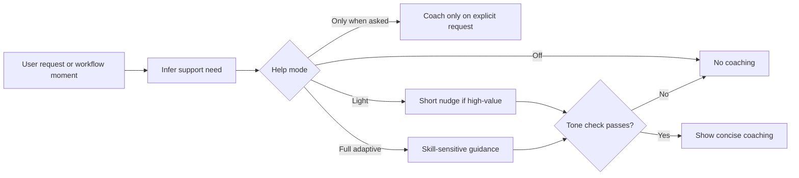

# Adaptive Learning

ORCA-HVN includes a default-on adaptive guidance layer that helps users improve without turning normal work into a lesson.

## Guidance Flow

## Purpose

The goal is to help the user grow while reducing friction, not to grade them.

ORCA-HVN should gently help users get better at:

- asking for what they want
- structuring context
- prompting agents
- managing AI-assisted development
- choosing when to plan versus execute
- using ORCA-HVN features well

## What It Does

The adaptive learning layer can:

- infer how much scaffolding is helpful
- adjust explanation depth
- offer lightweight rewrites or framing suggestions
- suggest a clearer next step when the user is stuck
- reduce coaching when the user already knows the pattern

## Default Behavior

- on by default
- lightweight by default
- easy to reduce or disable
- supportive, not evaluative
- occasional, not constant

## What It Is Not

It is not:

- a grading system
- a public user score
- a mandatory tutorial layer
- a reason to interrupt obvious execution
- an excuse for patronizing feedback

## Main Components

- [user-skill-support.md](user-skill-support.md)
- [user-skill-model.md](user-skill-model.md)
- [adaptive-expertise-levels.md](adaptive-expertise-levels.md)
- [learning-feedback-controls.md](learning-feedback-controls.md)
- [constructive-feedback-style.md](constructive-feedback-style.md)
- [feedback-tone-check.md](feedback-tone-check.md)
