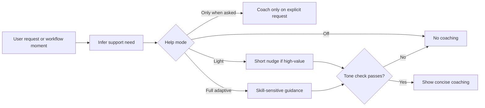

# Adaptive Learning

ORCA-HVN includes a default-on adaptive guidance layer that helps users improve without turning normal work into a lesson.

## Guidance Flow

## Purpose

The goal is to help the user grow while reducing friction, not to grade them.

ORCA-HVN should gently help users get better at:

- asking for what they want
- structuring context
- prompting agents
- managing AI-assisted development
- choosing when to plan versus execute
- using ORCA-HVN features well

## What It Does

The adaptive learning layer can:

- infer how much scaffolding is helpful
- infer when a dedicated explanation session may help more than inline coaching
- adjust explanation depth
- learn onboarding and setup preferences such as question density, jargon tolerance, and directness
- learn preferred involvement level, checkpoint cadence, and appetite for unattended execution
- offer lightweight rewrites or framing suggestions
- suggest a clearer next step when the user is stuck
- reduce coaching when the user already knows the pattern

This feeds primarily into the local instance-improvement loop, not directly into global framework defaults.

Explanation-mode learning is a specific local-instance case:

- default explain mode is `manual_only`
- users may opt into `suggest_when_helpful`
- users may opt into `predictive_auto_explain`
- predictive explanation should learn from repeated `/explain` use, repeated requests for concision, and explicit overrides
- predictive explanation should fail closed during high-risk operations

Onboarding preference capture is the front door for that system:

- first-run setup should ask a few explicit preference questions instead of inferring everything later
- explicit preference beats inference
- durable preference should be opt-in or strongly evidenced
- users should be able to raise or lower involvement mid-project without fighting the system

## Default Behavior

- on by default
- lightweight by default
- easy to reduce or disable
- supportive, not evaluative
- occasional, not constant

## What It Is Not

It is not:

- a grading system
- a public user score
- a mandatory tutorial layer
- a reason to interrupt obvious execution
- an excuse for patronizing feedback

## Main Components

- [user-skill-support.md](user-skill-support.md)
- [user-skill-model.md](user-skill-model.md)
- [adaptive-expertise-levels.md](adaptive-expertise-levels.md)
- [learning-feedback-controls.md](learning-feedback-controls.md)
- [constructive-feedback-style.md](constructive-feedback-style.md)
- [feedback-tone-check.md](feedback-tone-check.md)
