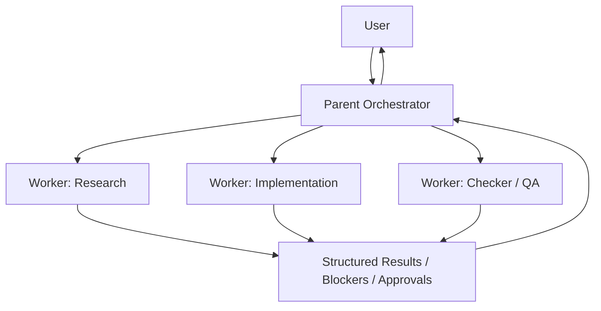

# Agent Orchestration

ORCA-HVN treats agent orchestration as a portable operating model.

The model should survive harness changes, feature differences, and vendor syntax differences.

## Role Diagram

## Core Questions

Orchestration means answering:

- who runs next
- what context they get
- what result they must return
- what happens if they fail, stall, or need approval
- who communicates with the user

## Core Principles

- orchestrate by capability, not by harness
- parent agent owns user communication
- subagents are workers, not direct responders
- delegate only when specialization, isolation, reuse, or parallelism clearly helps
- isolated context beats giant shared context
- explicit handoffs beat implicit magic
- observability and approvals matter as much as delegation
- use the simplest orchestration pattern that fits the job

## What Good Looks Like

ORCA-HVN should be strong at orchestration in practice, not just in naming.

A good ORCA orchestration run should make these things obvious:

- why the parent stayed single-agent or delegated
- which worker owns which slice
- what context each worker received
- what output shape each worker must return
- what happens if a worker blocks, stalls, or needs approval
- how results are merged back into one clear next step

## Parent Responsibilities

The parent orchestrator should:

- choose whether delegation is worth the overhead
- select the orchestration pattern
- separate critical-path work from sidecar work
- keep write ownership disjoint when workers can edit in parallel
- give every worker a compact context packet
- define verification and stop conditions up front
- ingest results and reconcile conflicts before responding to the user

## Worker Responsibilities

A worker should:

- own one bounded slice
- stay inside its scope and tool boundary
- return structured evidence instead of loose prose
- escalate when ambiguity, approval, or missing context blocks progress
- avoid silent scope expansion

## Selection Rules

Prefer single-agent execution when:

- the next step is on the critical path and easy to do locally
- splitting the work would mostly add latency
- the scope is too coupled to delegate cleanly

Prefer subagents when:

- there is a real specialization boundary
- multiple independent branches can run in parallel
- a checker should stay independent from a maker
- a long-running or background branch should not flood the parent context
- the user explicitly asked for parallel or delegated work

## Minimum Orchestration Packet

Every worker packet should define:

- role
- task
- owned scope
- linked artifacts
- constraints
- allowed tools or host
- expected output schema
- verification expectation
- stop conditions
- escalation path

Use:

- [templates/subagent-contract.md](../templates/subagent-contract.md)
- [templates/subagent-context-packet.md](../templates/subagent-context-packet.md)
- [templates/subagent-result-packet.md](../templates/subagent-result-packet.md)

## Scope

ORCA-HVN orchestration covers:

- delegation decisions
- parent and subagent role boundaries
- context passing
- blocker and escalation handling
- approvals
- result compression and ingestion
- harness mapping

Read next:

- [harness-agnostic-orchestration.md](harness-agnostic-orchestration.md)
- [parent-agent-vs-subagent.md](parent-agent-vs-subagent.md)
- [orchestration-patterns.md](orchestration-patterns.md)
- [model-council.md](model-council.md)
