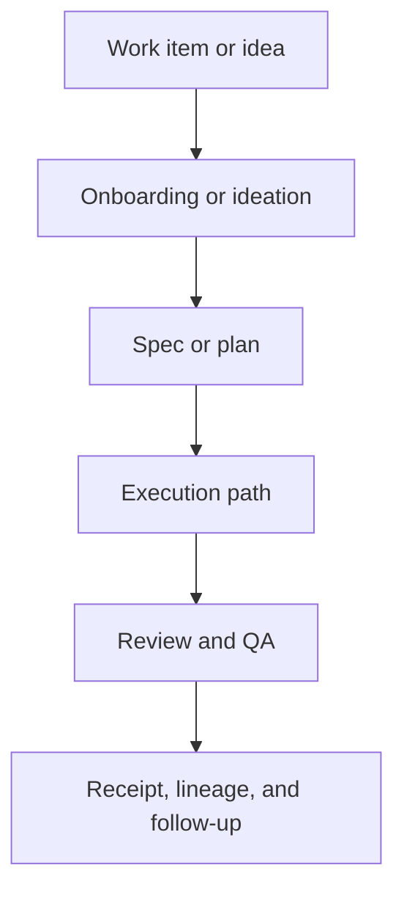

# Concept Map

ORCA-HVN is easier to use when you see how the parts connect.

## High-Level Flow

## Execution Path Choices

- Goal mode is for bounded long-running milestones.
- Background mode is for bounded unattended progress.
- Paved roads are official default paths for common cases.
- Runtime adaptation chooses the safest host-aware route.

## Coordination Layer

- shared state keeps current multi-role context
- controller and executor integration supports delegation
- checkpoints and approvals protect risky transitions

## Evidence Layer

- traces capture what happened
- receipts summarize what mattered
- lineage links artifacts together
- replay and restore help compare or recover workflows

