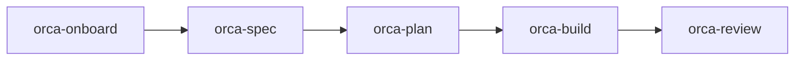

# First Workflow

If you are new to ORCA-HVN, do not start by learning every command.

Start with this one path:

1. `orca-onboard`
2. `orca-spec`
3. `orca-plan`
4. `orca-build`
5. `orca-review`

That is the default ORCA-HVN intro workflow.

This path is also the teaching path. It is meant to show a new user how the framework works while still being a real production path they can keep using later.

## What Each Step Does

### 1. `orca-onboard`

Turn a vague task into a clear work item with constraints, intent, and scope.

### 2. `orca-spec`

Write the contract for what should happen and what should not.

### 3. `orca-plan`

Break the spec into a concrete execution path.

### 4. `orca-build`

Implement the approved plan.

### 5. `orca-review`

Check for bugs, regressions, and obvious quality risks before going wider.

## Why This Path Exists

Most agent frameworks fail new users by showing a giant command catalog before they show a usable path.

ORCA-HVN should do the opposite:

- one work item
- one path
- one command per stage
- one clear next move

## What To Do After This

Only after this five-command path should you branch into:

- `orca-test-blind` for first-look QA
- `orca-goal` for bounded long-running work
- `orca-background` for unattended progress
- `orca-idea` for upstream ideation instead of implementation
- `orca-legacy` for inherited or fragile codebases
