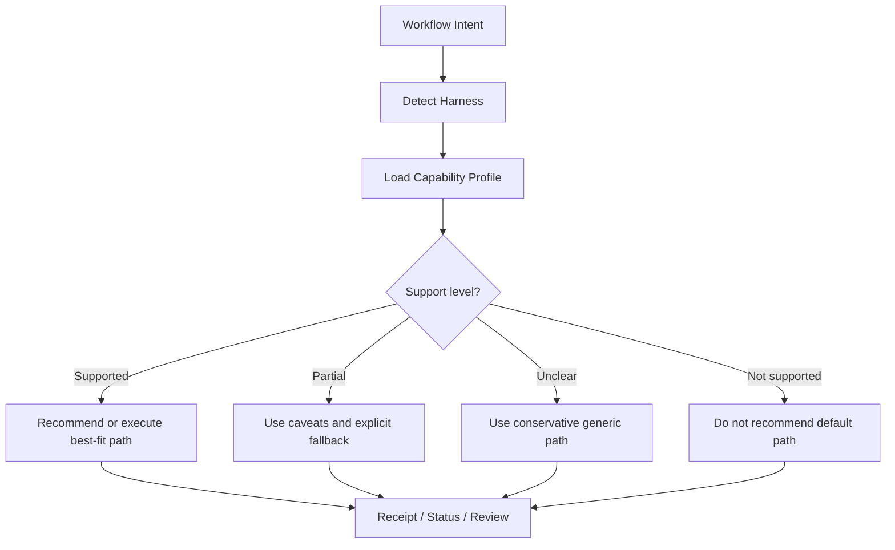

# Runtime Adaptation

Runtime adaptation is how ORCA Framework changes its execution path based on the current harness and the maintained compatibility knowledge.

Principle:

> Same ORCA Framework workflow intent, different execution path depending on the harness.

## Routing Model

## What It Is

Runtime adaptation means ORCA Framework:

- identifies or infers the current harness
- reads the relevant harness capability profile
- chooses the best supported path
- falls back safely when support is partial or unclear
- avoids recommending unsupported features

## What It Is Not

Runtime adaptation is not static documentation. Static docs describe possible paths. Runtime adaptation chooses one path at decision time.

## Source Of Truth

The compatibility layer is the source of truth:

- [compatibility matrix](compatibility-matrix.md)
- [harness capability profiles](harness-capability-profiles.md)
- [harness watch](harness-watch.md)

Scheduled research updates compatibility knowledge. Runtime adaptation consumes reviewed compatibility knowledge.

Receipts, lineage, replay, and restore make those runtime choices inspectable and safer to evolve.
The session improvement loop should capture repeated runtime mismatches so they become explicit framework work instead of staying as recurring operator friction.

Background mode is also part of runtime adaptation. Different harnesses may support:

- safe read-only unattended work
- limited local unattended writes
- no reviewed unattended mode beyond planning

Integration routing is part of runtime adaptation too. A mobile stack should not receive a web-first payments or deploy recommendation just because the harness can discuss both.
Runtime adaptation should also suppress recommendation clutter when the fit is weak, the use case is unclear, or the user already chose a different compatible tool.
It should prefer direct execution or the shortest setup-help path over capability theater.
The same applies to adaptive coaching: do not surface learning guidance merely because it is possible.

Controller/executor routing is part of runtime adaptation. A controller may choose one harness for orchestration and another for bounded execution when the pairing is clearer or safer than single-harness operation.
Subagent orchestration should follow the same rule: choose patterns by capability and fallback quality, not by vendor branding.

## Runtime Rule

If support is:

- `supported`: ORCA Framework may recommend the capability when the task is a good fit
- `partial`: ORCA Framework may use it with caveats and explicit fallback
- `not supported`: ORCA Framework should not recommend it as the default path
- `unclear`: ORCA Framework should stay conservative and use the generic safer path

## Review Gate

Newly detected support should not become a runtime default until it has been reviewed or classified as `Adopt now`. This keeps research updates from silently changing behavior before maintainers agree.

Receipts should capture the chosen runtime path. Replay should be used before broadening defaults after compatibility or policy changes. Restore should support rollback to known-good workflow states when a new path fails.

If unattended behavior is unclear for a harness, ORCA Framework should prefer foreground milestone execution instead of recommending background mode by default.
