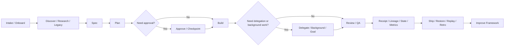

# Workflow

ORCA-HVN follows a staged workflow centered on a durable work item. In Linear-first mode, that work item is a Linear issue. In opt-out mode, it is the user's chosen issue, document, or tracker item.

When a workflow introduces a new external upstream influence or wrapper, update the attribution records as part of the same iteration.

## Workflow Map

## Standard Sequence

1. `orca-idea` or `orca-evaluate-idea`: structure or pressure-test an opportunity when the work has not yet earned a product spec.
2. `orca-plan-idea` or `orca-validate-idea`: synthesize a surviving idea into a memo, decision, and next experiment.
3. `orca-linear-intake` or `orca-onboard`: clarify issue context.
4. `orca-check-setup` or `orca-setup`: identify required external tools when the next phase depends on GitHub, Linear, MCP, or a host connector.
5. `orca-integration` or `orca-setup-integration`: choose and set up stack integrations when platform or product architecture decisions materially affect the path.
6. `orca-discover`: inspect the repo, platform, dependencies, and constraints.
7. `orca-legacy`: run repo archaeology and modernization prep when the system is inherited, under-documented, or fragile.
8. `orca-research`: gather external evidence when facts may be stale or unknown.
9. `orca-spec`: define goals, non-goals, user flows, and acceptance criteria.
10. `orca-linear-plan-comment` or `orca-plan`: create implementation phases, verification gates, and approval expectations.
11. `orca-next`: emit concise phase-exit guidance when the next move is not already obvious or underway.
12. `orca-goal`: decide whether the next bounded milestone should become a goal contract.
13. `orca-approve`: request or confirm approval when risk, scope, or confidence requires it.
14. `orca-background` or `orca-keep-going`: define bounded unattended scope when the user wants progress to continue while they are away.
15. delegation or subagent orchestration when specialization, isolation, checking, or parallelism clearly helps.
16. `orca-build`: implement approved scope.
17. `orca-trace`: record meaningful execution steps, decisions, and stop reason.
18. `orca-receipt`: summarize the run outcome in a compact execution receipt.
19. `orca-lineage`: link the new artifact to upstream and downstream workflow artifacts.
20. `orca-state`: maintain shared coordination state for multi-role or resumable runs.
21. `orca-metrics`: record timing, retries, and optional usage signals for the run.
22. `orca-review`: inspect behavior and maintainability.
23. `orca-design`: review UX, accessibility, responsive behavior, and product clarity.
24. `orca-test-blind`: run first-look QA with minimal context.
25. `orca-test-briefed`: retest with a bounded packet.
26. `orca-test-regression`: verify fixes and adjacent flows.
27. `orca-regression-task`: convert strong findings into reusable regression work.
28. `orca-checkpoint`: pause risky or ambiguous work for human inspection and decision.
29. `orca-inspect`: summarize current run identity, state, artifacts, and blockers for review or resume.
30. `orca-tool-review` or `orca-mcp-review`: govern new or risky external tools and MCP servers.
31. `orca-security` or `orca-security-check`: inspect security-relevant surfaces and untrusted inputs.
32. `orca-benchmark` and `orca-eval`: judge workflow quality when framework behavior is under review.
33. `orca-replay` or `orca-restore`: compare newer behavior or recover from known-good workflow states when needed.
34. `orca-linear-ship-check` or `orca-ship`: prepare release and done-state evidence.
35. `orca-retro`: capture lessons and follow-up work.
36. `orca-improve-framework`: review session friction and session-quality signals, then propose ORCA-HVN improvement work when the evidence is reusable.
37. `orca-status` or `orca-background-status`: explain current harness detection, enabled features, degraded capabilities, policy switches, receipts, and unattended-run state when behavior needs inspection.

## Default Execution Bias

ORCA should try to finish the local work before escalating.

That means:

- inspect first
- infer from existing artifacts when safe
- choose a bounded fallback when possible
- keep moving until a real blocker, approval gate, or irreversible decision appears

It should not use the user as the default loop for normal ambiguity, routine setup choices, or next-step decisions that can be made safely from the evidence already on hand.

## Recommended Linear Gates

- Triage
- Ready for Spec
- Spec Ready
- Ready for Build
- In Progress
- In Review
- In QA
- Ready to Ship
- Done

Actual state names may vary by team. ORCA-HVN expects equivalent gates.

## Reliability Layer

The workflow now relies on six supporting controls:

- idea one-pagers, scorecards, memos, and validation plans create a durable upstream decision record
- onboarding, discovery, and spec create durable context
- next-step guidance makes phase exits clear without adding process noise
- setup checks keep GitHub, Linear, and MCP dependencies explicit and optional when possible
- integration packs keep modern stack choices explicit, platform-aware, and validated
- orchestration patterns keep parent and worker responsibilities explicit when work benefits from delegation
- compatibility audits keep harness-specific claims explicit instead of assuming parity
- legacy archaeology turns under-documented systems into actionable modernization context
- goal contracts make long-running work bounded and verifiable
- run memory stores reusable facts and decisions
- traces record what happened
- receipts summarize what the run accomplished
- lineage links artifacts across the workflow
- replay and restore support comparison, recovery, and safer rollout
- background contracts, plans, loop guards, and receipts keep unattended progress bounded and inspectable
- shared state records the current multi-role coordination picture
- workflow metrics record time and retry burden
- evals judge how well it happened
- benchmark packs compare onboarding and spec quality over time
- regression tasks preserve repeated QA lessons
- the session improvement loop turns reusable framework friction and quality-signal evidence into backlog-ready improvement work
- approval gates control risky actions
- checkpoints create safe human intervention points
- inspector artifacts make paused and blocked runs resumable
- tool and MCP registries make external execution trust explicit
- contracts keep artifacts structurally consistent

## Opt-Out Workflow

If Linear is not used, define:

- Work item location
- State or gate labels
- Where comments or reports are written
- Where linked artifacts live
- Who can approve build and ship gates

Then run the same ORCA-HVN sequence against that record.

## Skipping Stages

Small changes may combine stages. A production feature touching auth, payments, data deletion, public UX, install scripts, or CI should not skip spec, review, security consideration, and QA.

When a major stage completes, use [next-step guidance](next-step-guidance.md) unless the next action is already being executed or the user has opted out.

If the work begins as a startup or business idea, stay on the ideation paved road until the opportunity memo and validation step are clear enough to justify `orca-spec`.

If a feature materially adapts an upstream project or adds a new direct integration, update [UPSTREAM.md](../UPSTREAM.md) and the attribution docs before calling the workflow complete.

If a missing integration blocks that next action, use [external tool setup](external-tool-setup.md) and [degraded mode](degraded-mode.md) before asking the user to install anything.

When harness capability matters, use [harness compatibility](harness-compatibility.md) and [compatibility matrix](compatibility-matrix.md) to choose the safest path.

When the top-level user experience changes, update [docs/README.md](README.md), [start-here.md](start-here.md), [feature-index.md](feature-index.md), [command-index.md](command-index.md), and the [wiki](../wiki/Home.md) as part of the same iteration.
